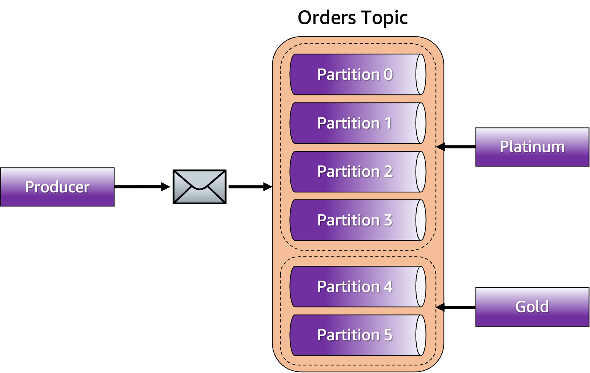
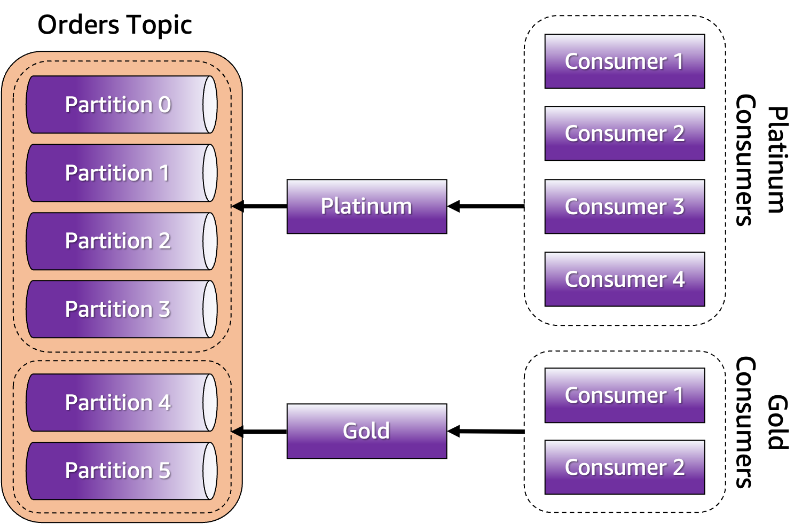

# Prioritizing Event Processing with Apache Kafka

Implement message prioritization in [Apache Kafka](https://kafka.apache.org) is often a hard task because Kafka doesn't support broker-level reordering of messages like some messaging technologies do. Though some developers see this as a limitation, the reality is that it isn't because Kafka is not supposed to allow message reordering. Kafka is a distributed [commit log](https://engineering.linkedin.com/distributed-systems/log-what-every-software-engineer-should-know-about-real-time-datas-unifying) and therefore messages are immutable and so their ordering is within partitions. This doesn't change the fact the developers may need to implement message prioritization in Kafka.

This project aims to address this problem while still proving a way to keep the implementation code simple. In Kafka, [partitions are a unit-of-parallelism, unit-of-storage, and unit-of-durability](https://www.buildon.aws/posts/in-the-land-of-the-sizing-the-one-partition-kafka-topic-is-king/01-what-are-partitions). However, when developers write code to handle partitions directly they end up writing a rather more complex code, and often need to give up of some facilities that the Kafka architecture provides such as automatic rebalancing of consumers when new partitions are added and/or when a group leader fails. This becomes even more important when developers are interacting with Kafka via frameworks like [Kafka Connect](https://kafka.apache.org/documentation/#connect) and [Kafka Streams](https://kafka.apache.org/documentation/streams/) that, by design, don't expect that partitions are handled directly.

This project addresses message prioritization by grouping partitions into simpler abstractions called buckets that express priority given their size. Bigger buckets mean a higher priority, and smaller buckets mean less priority. The project also addresses code simplicity by providing a way to do all of this with the pluggable architecture of Kafka.

Let's understand how this works with an example.



Here we can see that the partitions were grouped into the buckets `Platinum` and `Gold`. The Platinum bucket has a higher priority and therefore was configured to have 70% of the allocation, whereas the Gold bucket has lower priority and therefore was configured to have only 30%. This means that for a topic that contains 6 partitions, 4 of them will be associated with the Platinum bucket and 2 will be associated with the Gold bucket. To implement the message prioritization, there has to be a process that ensures that messages with higher priority will end up in one the partitions from the Platinum bucket and messages with lower priority will end up in one the partitions from the Gold bucket. Consumers need to subscribe to the topic knowing which buckets they need to be associated with. This means that developers can decide to execute more consumers for the Platinum bucket and fewer consumers for the Gold bucket to ensure that they process high priority messages faster.

To ensure that each message will end up in their respective bucket, use the `BucketPriorityPartitioner`. This partitioner uses data in the message key to decide which bucket to use and therefore which partition from the bucket the message should be written. This partitioner distributes the messages within the bucket using a round robin algorithm to maximize consumption parallelism. On the consumer side, use the `BucketPriorityAssignor` to ensure that the consumer will be assigned only to the partitions that represent the bucket they want to process.



With the bucket priority, you can implement message prioritization by having more consumers working on buckets with higher priorities, while buckets with less priority can have fewer consumers. Message prioritization can also be obtained by executing these consumers in an order that gives preference to processing high priority buckets before the less priority ones. While coordinating this execution might involve some extra coding from your part (perhaps using some sort of scheduler) you don't have to implement low-level code to manage partition assignment and keep your consumers simple by leveraging the standard `subscribe()` and `poll()` methods.

## Building the project

The first thing you need to do to start using this partitioner is building it. In order to do that, you need to install the following dependencies:

- [Java 11+](https://openjdk.java.net/)
- [Apache Maven](https://maven.apache.org/)

After installing these dependencies, execute the following command:

```bash
mvn clean package
```

## Using the partitioner

To use the `BucketPriorityPartitioner` in your producer you need to register it in the configuration.

```bash
Properties configs = new Properties();

configs.setProperty(ProducerConfig.PARTITIONER_CLASS_CONFIG,
   BucketPriorityPartitioner.class.getName());

KafkaProducer<K, V> producer = new KafkaProducer<>(configs);
```

To work properly you need to specify in the configuration which topic will have its partitions grouped into buckets.
This is important because in Kafka topics are specified in a message level and not in a producer level.
This means that the same producer can be used to write messages into different topics, so the partitioner needs to know which topic will have their partitions grouped into buckets.


```bash
configs.setProperty(BucketPriorityConfig.TOPIC_CONFIG, "orders");
```

Finally you have to specify in the configuration which buckets will be configured and what is the partition allocation for each one of them.
The partition allocation is specified in terms of percentage.
Note that the usage of the symbol `%` is optional.


```bash
configs.setProperty(BucketPriorityConfig.BUCKETS_CONFIG, "Platinum, Gold");
configs.setProperty(BucketPriorityConfig.ALLOCATION_CONFIG, "70%, 30%");
```

The partitioner ensures that all partitions from the topic will be assigned to the buckets.
In case of the allocation result in some partitions being left behind because the distribution is not even, the remaining partitions will be assigned to the buckets using a round robin algorithm over the buckets sorted by allocation.

### Messages and buckets

In order to specify which bucket should be used your producer need to provide this information on the message key.
The partitioner will inspect each key in the attempt to understand in which bucket the message should be written.
For this reason the key must be an instance of a [java.lang.String](https://docs.oracle.com/en/java/javase/11/docs/api/java.base/java/lang/String.html) and it need to contain the bucket name either as one literal string or as the first part of a string separated by an delimiter.
For example, to specify that the bucket is `Platinum` then following examples are valid:

* Key = `"Platinum"`
* Key = `"Platinum-001"`
* Key = `"Platinum-Group01-001"`

The default delimiter is `-` but you can change to something else:

```bash
configs.setProperty(BucketPriorityConfig.DELIMITER_CONFIG, "|");
```

### Fallback partitioner

There are some situations where the partitioner will need to know what to do when there is not enough data available in the message to decide which bucket to use. For instance:

* When the topic specified in the message doesn't need message prioritization.
* When a key is not present in the message or it's not using the right format.
* When the data about which bucket to use don't exist or can't be found.

For these situations an fallback partitioner will be used.
Here is an example of configuring the fallback partitioner to round-robin:

```bash
configs.setProperty(BucketPriorityConfig.FALLBACK_PARTITIONER_CONFIG,
   "org.apache.kafka.clients.producer.RoundRobinPartitioner");
```

Discarding any message that can't be sent to any of the buckets is also possible:

```bash
configs.setProperty(BucketPriorityConfig.FALLBACK_PARTITIONER_CONFIG,
   "com.riferrei.kafka.core.DiscardPartitioner");
```

If you don't configure a fallback partitioner explicitly, Kafka's default partitioner will be used.

## Using the assignor

To use the `BucketPriorityAssignor` in your consumer you need to register it in the configuration.

```bash
Properties configs = new Properties();

configs.setProperty(ConsumerConfig.PARTITION_ASSIGNMENT_STRATEGY_CONFIG,
   BucketPriorityAssignor.class.getName());

KafkaConsumer<K, V> consumer = new KafkaConsumer<>(configs);
```

To work properly you need to specify in the configuration which topic will have its partitions grouped into buckets.
This is important because in Kafka consumers can subscribe to multiple topics.
This means that the same consumer can be used to read messages from different topics, so the assignor needs to know which topic will have their partitions grouped into buckets.


```bash
configs.setProperty(BucketPriorityConfig.TOPIC_CONFIG, "orders");
```

You also have to specify in the configuration which buckets will be configured and what is the partition allocation for each one of them.
The partition allocation is specified in terms of percentage.
Note that the usage of the symbol `%` is optional.
Ideally the partition allocation configuration needs to be the same used in the producer.


```bash
configs.setProperty(BucketPriorityConfig.BUCKETS_CONFIG, "Platinum, Gold");
configs.setProperty(BucketPriorityConfig.ALLOCATION_CONFIG, "70%, 30%");
```

The assignor ensures that all partitions from the topic will be assigned to the buckets.
In case of the allocation result in some partitions being left behind because the distribution is not even, the remaining partitions will be assigned to the buckets using a round robin algorithm over the buckets sorted by allocation.

Finally you need to specify in the configuration which bucket the consumer will be associated.

```bash
configs.setProperty(BucketPriorityConfig.BUCKET_CONFIG, "Platinum");
```

### What about the other topics?

As you may know in Kafka a consumer can subscribe to multiple topics, allowing the same consumer to read messages from partitions belonging to different topics.
Because of this the assignor ensures that only the topic specified in the configuration will have its partitions assigned to the consumers using the bucket priority logic.
The other topics will have their partitions assigned to consumers using a fallback assignor.

Here is an example of configuring the fallback assignor to round-robin:

```bash
configs.setProperty(BucketPriorityConfig.FALLBACK_ASSIGNOR_CONFIG,
   "org.apache.kafka.clients.consumer.RoundRobinAssignor");
```

If you don't configure a fallback assignor explicitly, Kafka's default assignor will be used.

## Security

See [CONTRIBUTING](CONTRIBUTING.md#security-issue-notifications) for more information.

## License

This project is licensed under the MIT-0 License. See the [LICENSE](./LICENSE) file.
